# MTC Career Portal - Feature Showcase & Screenshots

**Document Version:** 1.1
**Date:** January 2026
**Screenshots Location:** `./screenshots/`

---

## Quick Reference - All Pages

| # | Page | URL | Screenshot |
|---|------|-----|------------|
| 1 | Homepage | `/` | `01_homepage_desktop.png` |
| 2 | Job Listings | `/jobs` | `02_jobs_listing_desktop.png` |
| 3 | Job Details | `/jobs/[id]` | `03_job_detail_desktop.png` |
| 4 | Application Form | `/jobs/[id]/apply` | `04_application_form_desktop.png` |
| 5 | Career Pathways | `/pathways` | `05_career_pathways_desktop.png` |
| 6 | Benefits | `/benefits` | `06_benefits_desktop.png` |
| 7 | Culture | `/culture` | `07_culture_desktop.png` |
| 8 | Diversity & Inclusion | `/diversity` | `08_diversity_desktop.png` |
| 9 | FAQ | `/faq` | `09_faq_desktop.png` |
| 10 | Privacy Policy | `/privacy` | `10_privacy_policy_desktop.png` |
| 11 | Portal Selector | `/login` | `11_login_portal_selector_desktop.png` |
| 12 | HR Dashboard | `/admin` | `12_admin_dashboard_desktop.png` |
| 13 | Analytics Dashboard | `/admin/analytics` | `13_admin_analytics_desktop.png` |
| 14 | Jobs Management | `/admin/jobs` | `14_admin_jobs_desktop.png` |
| 15 | Applications List | `/admin/applications` | `15_admin_applications_desktop.png` |
| 16 | Applicant Portal | `/portal` | `16_applicant_portal_desktop.png` |
| 17 | Application Detail | `/admin/applications/[id]` | `17_admin_application_detail_desktop.png` |

---

## Section 1: Public Career Site

### 1.1 Homepage

**Desktop View:**
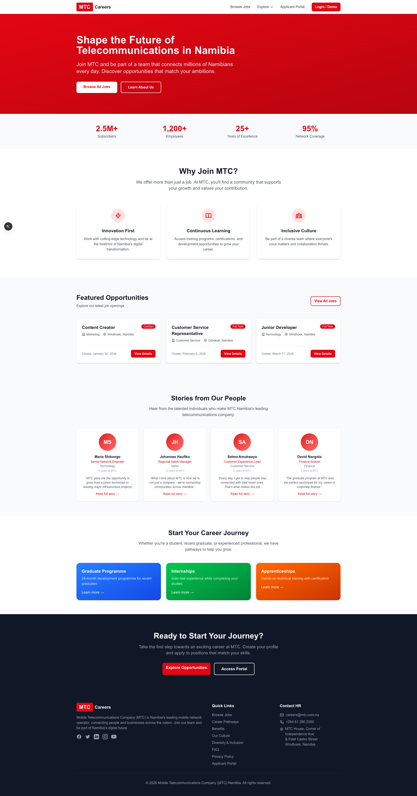

**Mobile View:**
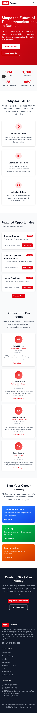

**Key Features:**
- Hero section with "Join MTC" messaging and MTC brand colors (red/white)
- Statistics bar showing employee count and regional presence
- Featured jobs section with job cards
- Employee stories/testimonials
- Career pathways preview
- Full footer with navigation, social links, and contact info

---

### 1.2 Job Listings

**Desktop View:**
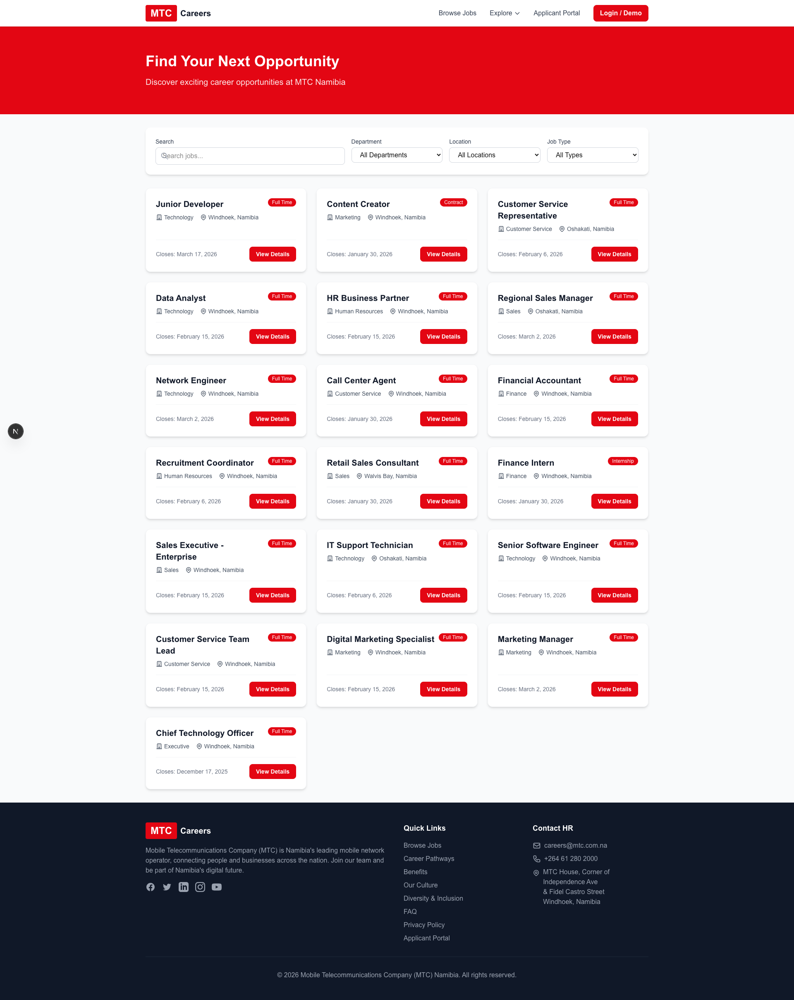

**Mobile View:**
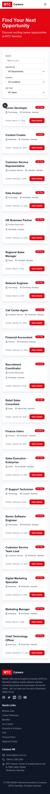

**Key Features:**
- Keyword search functionality
- Filter dropdowns (Department, Location, Job Type)
- Clean job cards grid layout
- Job count display
- Salary range visibility

---

### 1.3 Job Details

**Desktop View:**
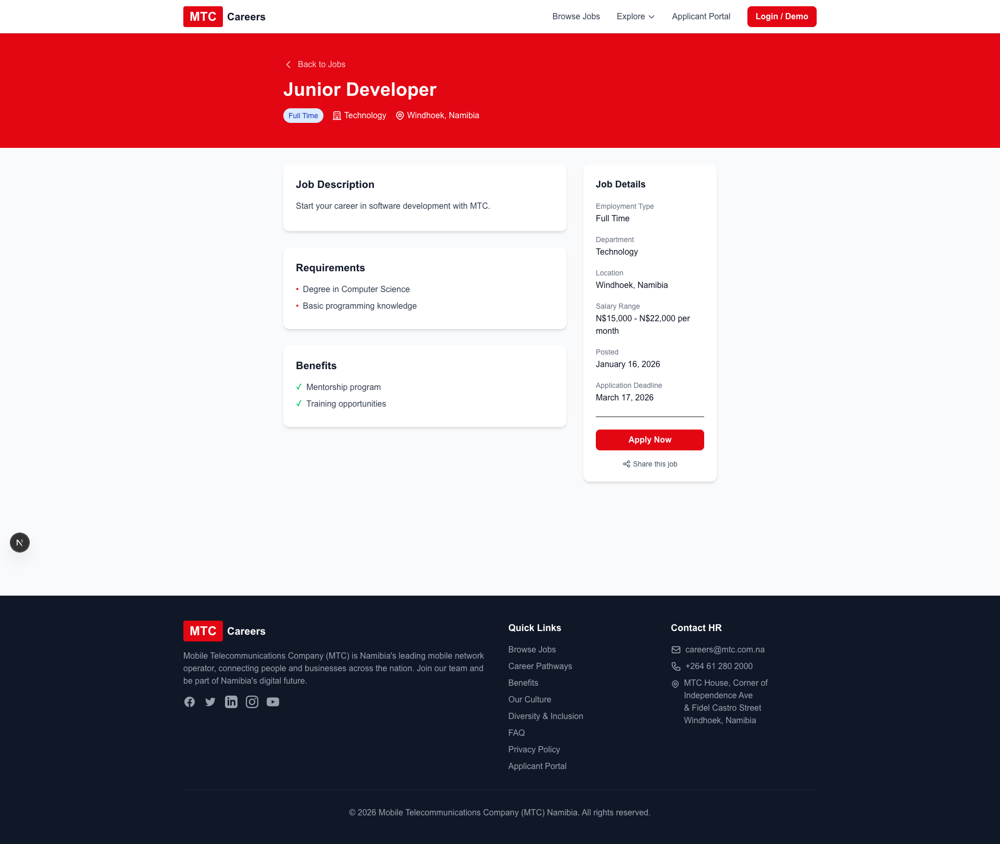

**Key Features:**
- Complete job information (title, department, location, type, salary)
- Full job description
- Requirements section with bullet points
- Benefits information
- Prominent "Apply Now" button

---

### 1.4 Application Form - **NEW COMPLIANCE FEATURES**

**Desktop View:**
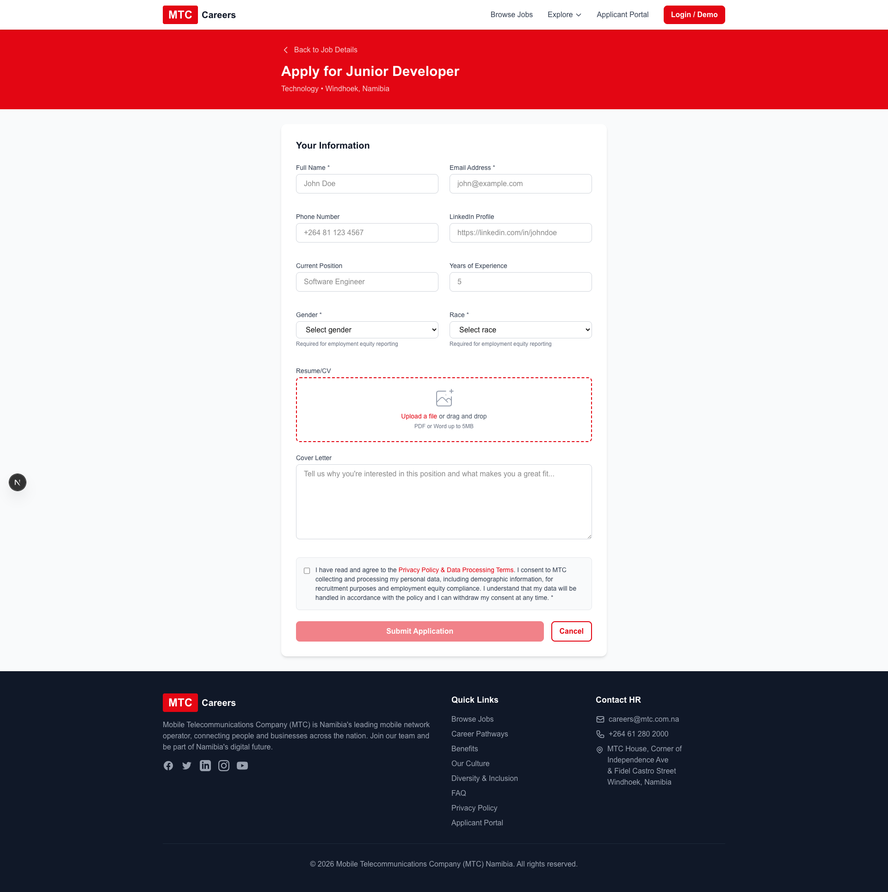

**Mobile View:**


**Key Features:**
- Personal information fields (name, email, phone)
- Professional info (current position, experience years)
- **Gender dropdown** - Employment equity compliance (NEW)
- **Race dropdown** - Employment equity compliance (NEW)
- Resume upload with drag-and-drop
- Cover letter text area
- **Privacy consent checkbox** - Must agree to continue (NEW)
- Submit button disabled until consent given

---

### 1.5 Career Pathways

**Desktop View:**
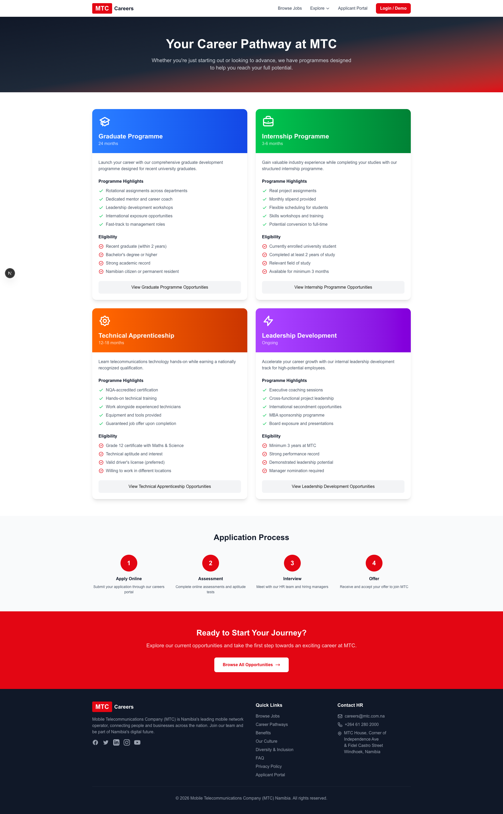

**Mobile View:**
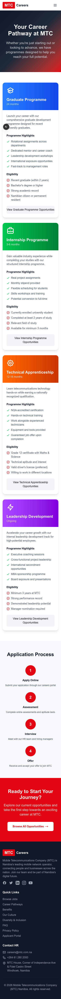

**Key Features:**
- Graduate Programme details
- Internship Programme for students
- Apprenticeship Programme for skills-based training
- Leadership Programme for management development

---

### 1.6 Benefits

**Desktop View:**
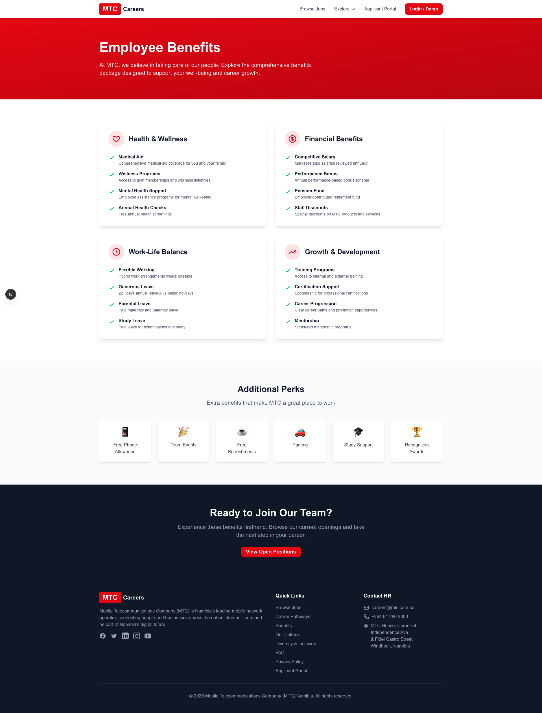

**Mobile View:**
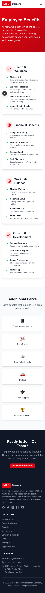

**Key Features:**
- Comprehensive employee benefits breakdown
- Health and wellness benefits
- Professional development opportunities
- Work-life balance initiatives

---

### 1.7 Culture

**Desktop View:**
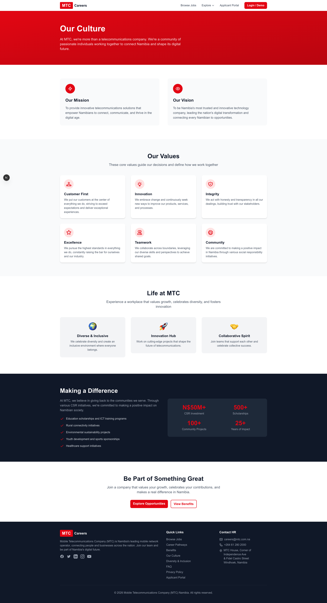

**Mobile View:**
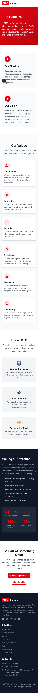

**Key Features:**
- Company values and mission
- Work environment showcase
- Team collaboration highlights

---

### 1.8 Diversity & Inclusion

**Desktop View:**
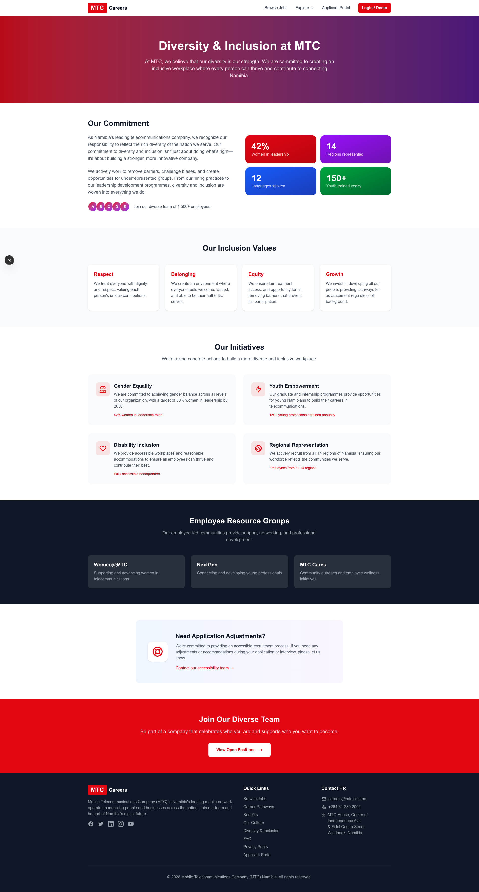

**Mobile View:**


**Key Features:**
- D&I commitment statement
- Statistics (42% women in leadership, 14 regions)
- Inclusion values: Respect, Belonging, Equity, Growth
- Initiatives: Gender equality, youth empowerment, disability inclusion
- Employee Resource Groups: Women@MTC, NextGen, MTC Cares

---

### 1.9 FAQ

**Desktop View:**
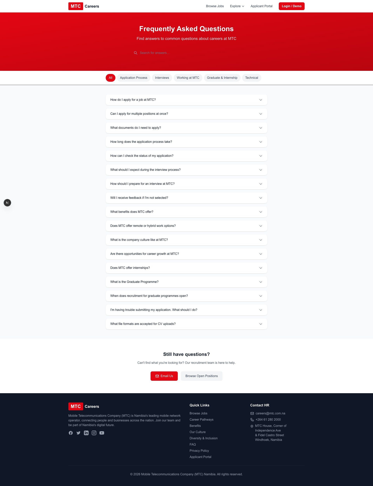

**Mobile View:**
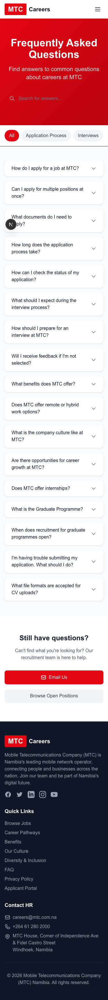

**Key Features:**
- Search functionality for questions
- Category filters (Application, Interview, Benefits, etc.)
- Expandable accordion Q&A format

---

### 1.10 Privacy Policy - **NEW PAGE**

**Desktop View:**
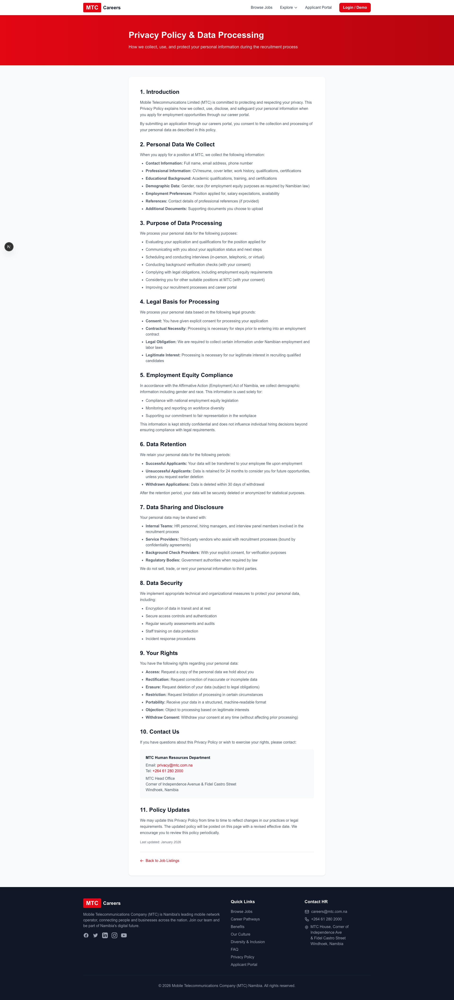

**Mobile View:**
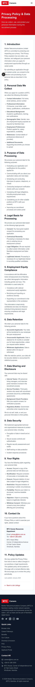

**Key Features:**
- **POPIA/GDPR compliant** data processing policy
- **Affirmative Action Act compliance** explanation
- Data collection transparency
- Employment equity data justification
- Data retention policies
- Candidate rights (access, rectification, erasure)
- Privacy team contact information

---

## Section 2: HR Administration Portal

### 2.1 Portal Selector

**Desktop View:**
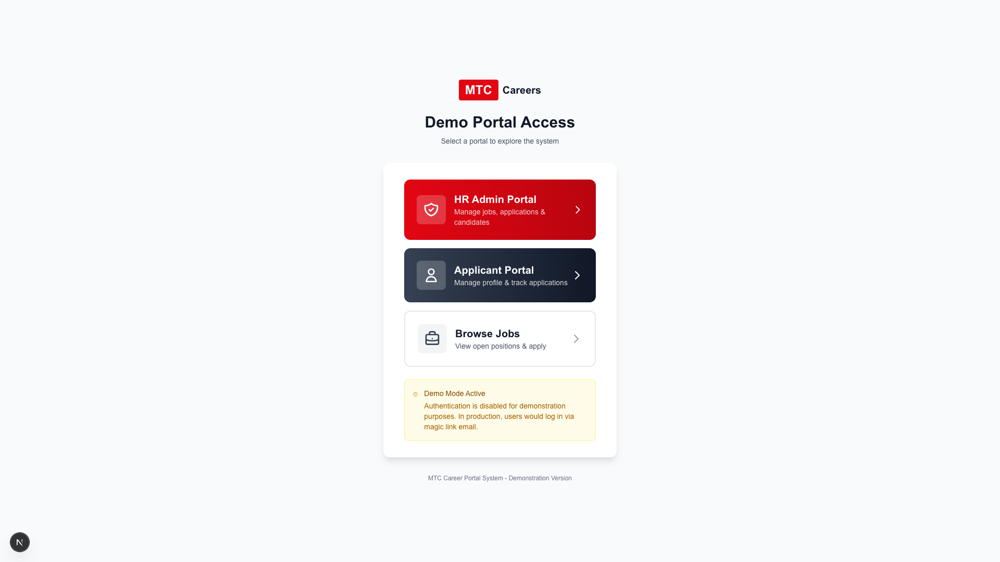

**Mobile View:**
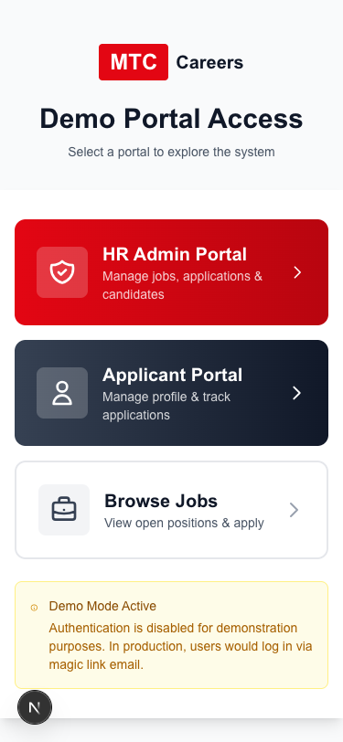

**Key Features:**
- Three clear options: HR Admin, Applicant Portal, Browse Jobs
- Demo mode notice (no login required for demonstration)

---

### 2.2 HR Dashboard

**Desktop View:**
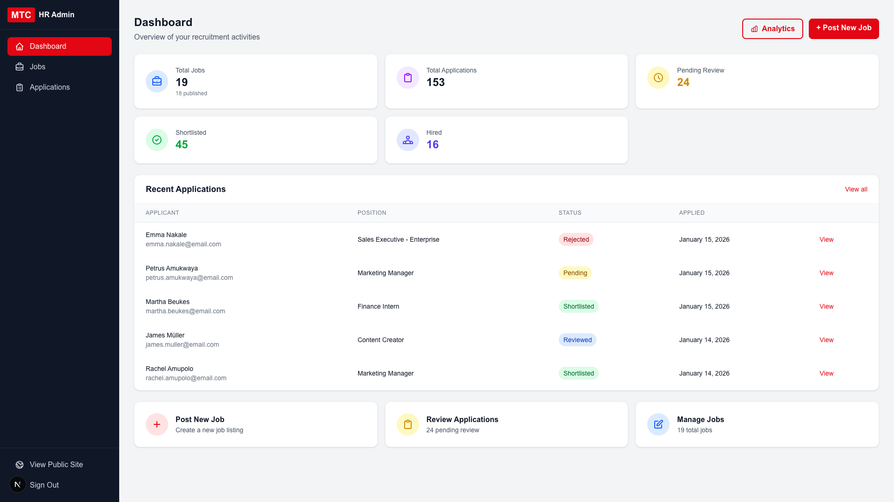

**Mobile View:**
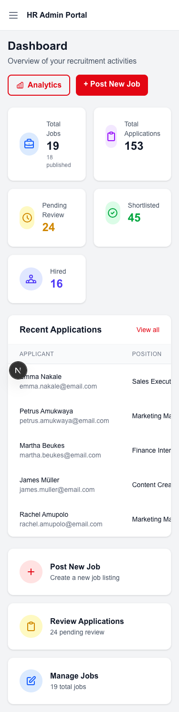

**Key Features:**
- At-a-glance statistics cards (Total Jobs, Applications, Pending, Shortlisted, Hired)
- Quick access buttons (Analytics, Post Job)
- Recent applications table
- Quick actions panel

---

### 2.3 Analytics Dashboard - **NEW PAGE**

**Desktop View:**
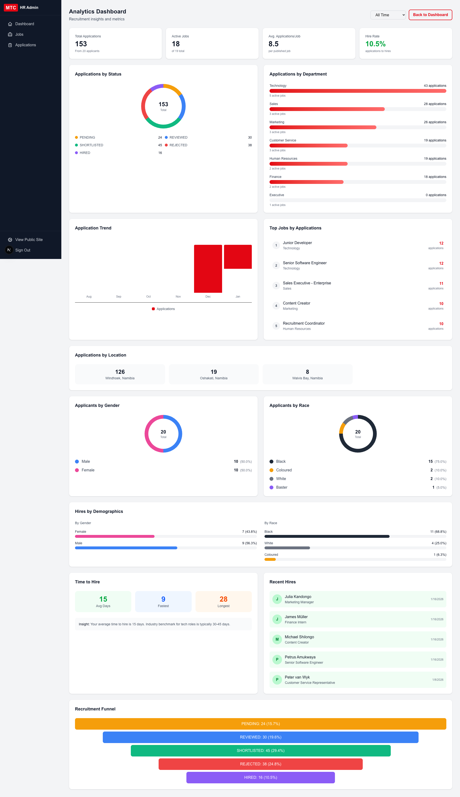

**Mobile View:**
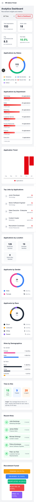

**Key Features:**
- Key metrics row (Applications, Jobs, Avg/Job, Hire Rate)
- Applications by Status - Donut chart
- Applications by Department - Bar chart
- Monthly application trends
- Top jobs by application count
- Applications by location
- Time to hire metrics
- **Gender Distribution** - Donut chart (NEW)
- **Race Distribution** - Donut chart (NEW)
- **Hires by Demographics** - Gender and race breakdowns (NEW)
- Recruitment funnel visualization

---

### 2.4 Jobs Management

**Desktop View:**
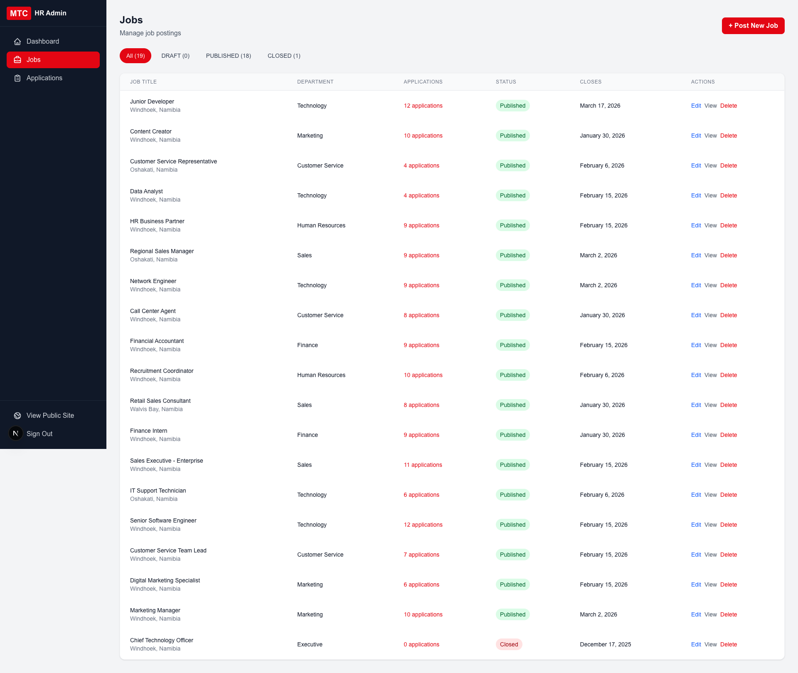

**Mobile View:**
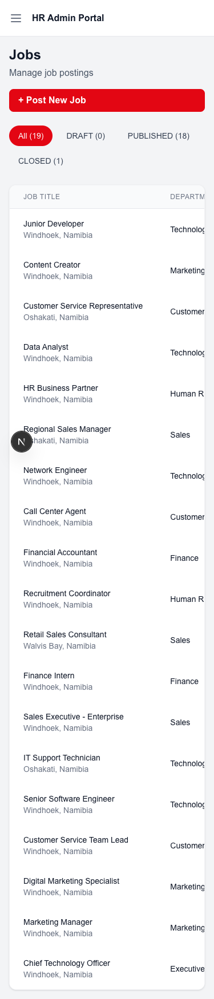

**Key Features:**
- Jobs table with title, department, location, status
- Application count per job
- Status badges (Published, Draft, Closed)
- Edit and view actions
- "New Job" button

---

### 2.5 Applications List

**Desktop View:**


**Mobile View:**


**Key Features:**
- Filter by status and job
- Applications table with applicant info
- Status badges (Pending, Reviewed, Shortlisted, Rejected, Hired)
- Quick view links

---

### 2.6 Application Detail

**Desktop View:**
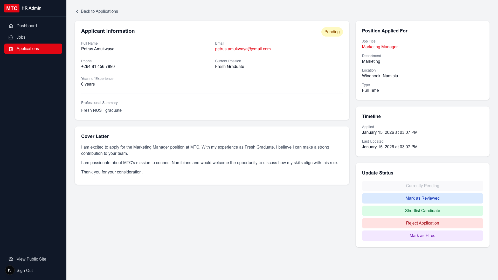

**Key Features:**
- Complete applicant information (name, email, phone)
- Job applied for and application date
- Current status display
- Cover letter full text
- One-click status update buttons (Review, Shortlist, Reject, Hire)
- Email history log
- Automated email triggers on status change

---

## Section 3: Applicant Portal

### 3.1 Applicant Dashboard

**Desktop View:**
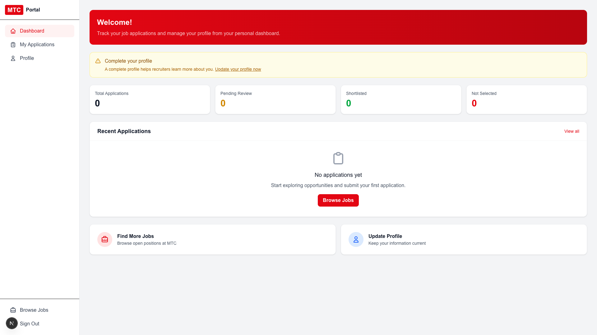

**Mobile View:**
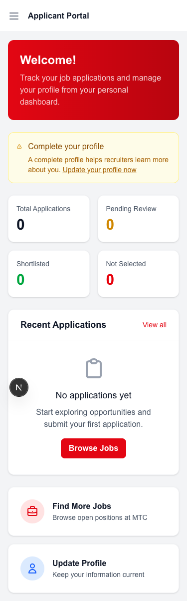

**Key Features:**
- Welcome header with applicant name
- Application status summary
- List of all submitted applications
- Visual status indicators

---

## Section 4: Mobile Responsiveness Summary

All pages have been captured in both desktop (1920x1080) and mobile (375x812) viewports:

| Page | Desktop | Mobile |
|------|---------|--------|
| Homepage | `01_homepage_desktop.png` | `01_homepage_mobile.png` |
| Job Listings | `02_jobs_listing_desktop.png` | `02_jobs_listing_mobile.png` |
| Application Form | `04_application_form_desktop.png` | `04_application_form_mobile.png` |
| HR Dashboard | `12_admin_dashboard_desktop.png` | `12_admin_dashboard_mobile.png` |
| Analytics | `13_admin_analytics_desktop.png` | `13_admin_analytics_mobile.png` |

---

## Section 5: Key User Flows

### Flow 1: Job Application Process
1. Browse jobs (`/jobs`) - See `02_jobs_listing_desktop.png`
2. Select a job - See `03_job_detail_desktop.png`
3. Click "Apply Now" - See `04_application_form_desktop.png`
4. Fill form, select gender/race
5. Check privacy consent checkbox
6. Submit application

### Flow 2: HR Review Process
1. HR Dashboard - See `12_admin_dashboard_desktop.png`
2. Click application - See `17_admin_application_detail_desktop.png`
3. Review candidate info
4. Click "Shortlist" - Status updated
5. Automatic email sent to candidate

### Flow 3: Analytics Review
1. HR Dashboard - Click "Analytics"
2. View overall metrics - See `13_admin_analytics_desktop.png`
3. Check gender/race demographics
4. Review hire demographics
5. Export insights (future feature)

---

## Presentation Order

For the demo presentation, show screenshots in this order:

### Part 1: The Problem (Current State)
- Mention third-party sites, hand-delivered applications

### Part 2: The Solution (Public Site)
1. `01_homepage_desktop.png` - First impression
2. `02_jobs_listing_desktop.png` - Easy search
3. `03_job_detail_desktop.png` - Complete information
4. `04_application_form_desktop.png` - Modern, compliant

### Part 3: Compliance Features
5. `10_privacy_policy_desktop.png` - POPIA/GDPR ready
6. `04_application_form_desktop.png` - Consent checkbox & gender/race fields

### Part 4: HR Power Tools
7. `12_admin_dashboard_desktop.png` - At-a-glance metrics
8. `13_admin_analytics_desktop.png` - Data insights & demographics
9. `15_admin_applications_desktop.png` - Application management
10. `17_admin_application_detail_desktop.png` - Candidate review

### Part 5: Mobile Experience
11. `01_homepage_mobile.png` - Responsive design
12. `04_application_form_mobile.png` - Mobile application

---

## Screenshot Files

All screenshots are located in the `./screenshots/` directory:

```
screenshots/
├── 01_homepage_desktop.png
├── 01_homepage_mobile.png
├── 02_jobs_listing_desktop.png
├── 02_jobs_listing_mobile.png
├── 03_job_detail_desktop.png
├── 03_job_detail_mobile.png
├── 04_application_form_desktop.png
├── 04_application_form_mobile.png
├── 05_career_pathways_desktop.png
├── 05_career_pathways_mobile.png
├── 06_benefits_desktop.png
├── 06_benefits_mobile.png
├── 07_culture_desktop.png
├── 07_culture_mobile.png
├── 08_diversity_desktop.png
├── 08_diversity_mobile.png
├── 09_faq_desktop.png
├── 09_faq_mobile.png
├── 10_privacy_policy_desktop.png
├── 10_privacy_policy_mobile.png
├── 11_login_portal_selector_desktop.png
├── 11_login_portal_selector_mobile.png
├── 12_admin_dashboard_desktop.png
├── 12_admin_dashboard_mobile.png
├── 13_admin_analytics_desktop.png
├── 13_admin_analytics_mobile.png
├── 14_admin_jobs_desktop.png
├── 14_admin_jobs_mobile.png
├── 15_admin_applications_desktop.png
├── 15_admin_applications_mobile.png
├── 16_applicant_portal_desktop.png
├── 16_applicant_portal_mobile.png
└── 17_admin_application_detail_desktop.png
```

---

*This document prepared for MTC Career Portal demonstration and proposal documentation.*
*Screenshots generated automatically using Puppeteer.*
